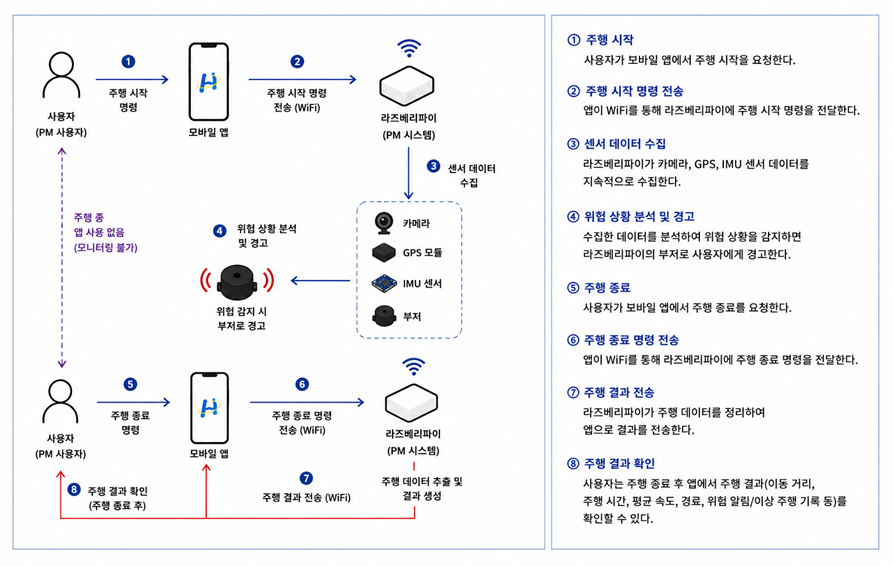
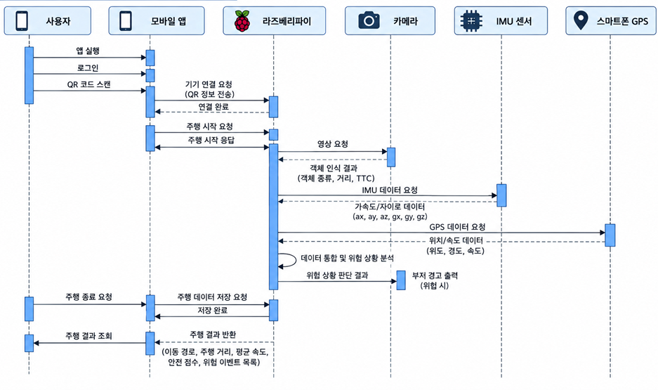
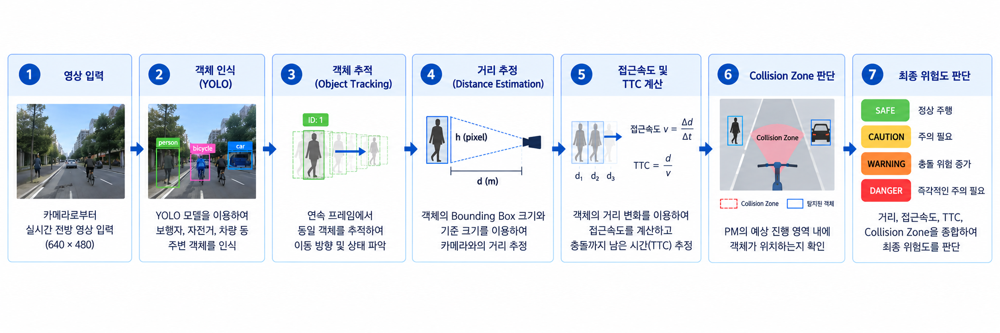
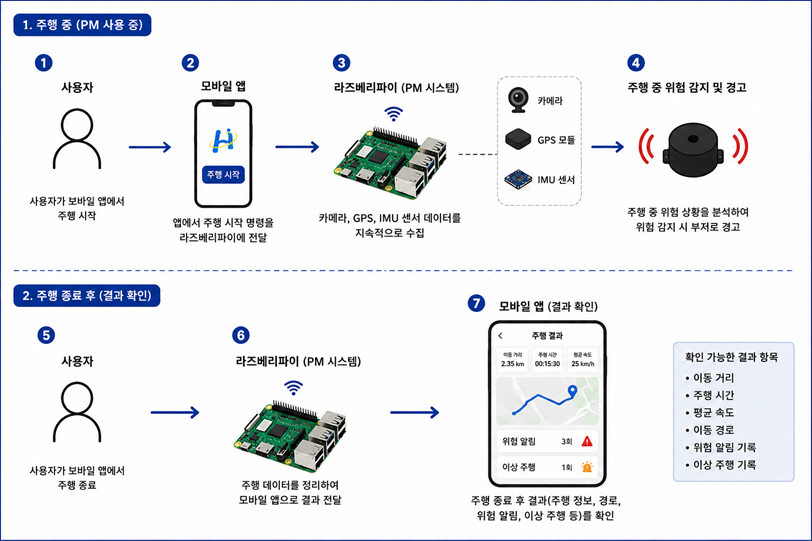
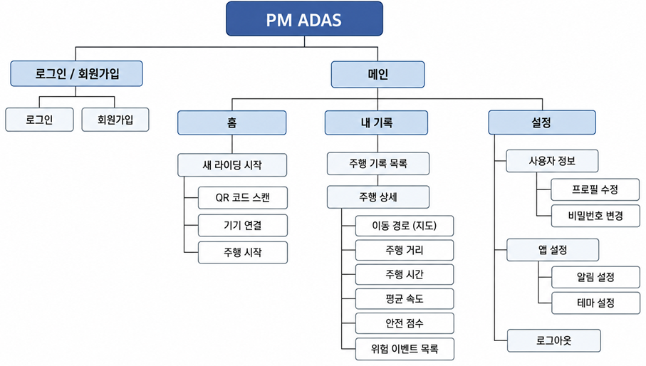
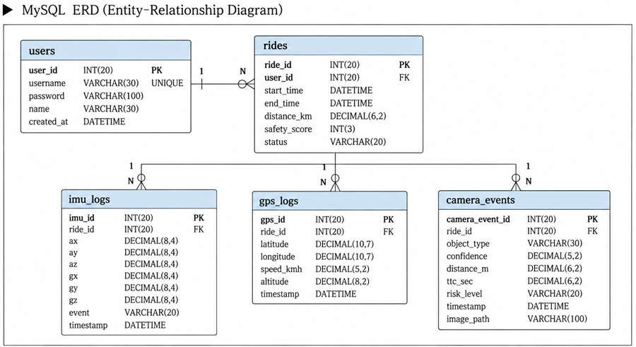

# 🛴 PM 전용 스마트 ADAS 시스템

## 💡1. 프로젝트 개요

### 1-1. 프로젝트 소개

- **프로젝트 명** : PM 전용 스마트 ADAS 시스템
- **프로젝트 정의** : 카메라와 센서를 활용하여 PM 주행 중 주변 객체와 위험 상황을 인식하고, 사용자에게 실시간으로 위험을 알려주는 주행 안전 보조 시스템


### 1-2. 개발 배경 및 필요성

최근 전동킥보드와 같은 개인형 이동장치(PM)의 이용이 증가하면서 보행자, 자전거, 차량 등과의 충돌 위험도 함께 증가하고 있다.

자동차의 경우 ADAS(Advanced Driver Assistance System)를 통해 전방 충돌 위험이나 주변 상황을 운전자에게 알려주는 다양한 안전 기능이 적용되고 있지만, PM은 운전자를 보조할 수 있는 안전 기능이 상대적으로 부족하다.

특히 PM은 보행자와 차량이 함께 존재하는 환경을 주행하기 때문에 단순히 주변 객체를 탐지하는 것뿐만 아니라, 객체와의 거리와 접근 상황, 실제 진행 경로 등을 함께 고려하여 위험 상황을 판단할 필요가 있다.

이에 본 프로젝트에서는 Raspberry Pi 5와 Camera Module 3를 기반으로 전방 객체를 실시간으로 인식하고, 객체와의 거리와 접근속도, TTC(Time To Collision), Collision Zone 등을 활용하여 충돌 위험도를 판단하는 PM 전용 ADAS 시스템을 구현한다.

또한 GPS와 IMU 센서를 활용하여 주행 위치와 주행 중 발생한 위험 이벤트를 기록하고, 주행 종료 후 사용자가 자신의 주행 정보를 확인할 수 있도록 구성한다.


### 1-3. 프로젝트 특장점

- **PM 주행 환경을 고려한 위험 판단**
  - 개인형 이동장치의 주행 환경을 고려하여 전방 위험 상황을 판단한다.

- **실시간 객체 인식 및 추적**
  - YOLO를 이용하여 보행자, 자전거, 차량 등의 객체를 인식하고 동일 객체를 연속 프레임에서 추적한다.

- **다중 요소 기반 충돌 위험 판단**
  - 단순 거리뿐만 아니라 접근속도, TTC, Collision Zone을 함께 활용하여 위험도를 판단한다.

- **Raspberry Pi 기반 실시간 처리**
  - Raspberry Pi 5에서 카메라 영상과 센서 데이터를 처리하여 실시간으로 위험 상황을 분석한다.

- **주행 정보 및 위험 이벤트 기록**
  - GPS와 IMU 센서를 이용하여 위치와 주행 정보를 기록하고, 주행 중 발생한 위험 이벤트를 확인할 수 있도록 한다.


### 1-4. 주요 기능

#### ① 실시간 객체 인식
Camera Module 3에서 입력되는 전방 영상을 YOLO 모델로 분석하여 보행자, 자전거, 차량 등의 객체를 인식한다.

#### ② 객체 추적 및 거리 추정
인식된 객체를 프레임 간 추적하고 Bounding Box 정보를 활용하여 객체와 PM 사이의 거리를 추정한다.

#### ③ 접근속도 및 TTC 계산
객체와의 거리 변화를 이용하여 접근속도를 계산하고 TTC(Time To Collision)를 통해 예상 충돌 시간을 계산한다.

#### ④ Collision Zone 기반 위험 판단
PM의 예상 진행 영역을 Collision Zone으로 설정하여 객체가 실제 진행 경로 내에 위치하는지 확인한다.

#### ⑤ 실시간 위험 경고
거리, 접근속도, TTC, Collision Zone을 종합하여 위험도를 SAFE / CAUTION / WARNING / DANGER 단계로 구분하고 위험 상황 발생 시 사용자에게 경고한다.

#### ⑥ 주행 데이터 기록
GPS를 이용하여 주행 위치와 경로를 기록하고, IMU 센서를 통해 급정거·급가속·전도 등의 주행 이벤트를 감지한다.

#### ⑦ 주행 결과 확인
주행 종료 후 모바일 웹에서 이동 경로, 주행 거리, 주행 시간, 평균 속도 및 위험 이벤트 등의 정보를 확인할 수 있다.


### 1-5. 기대 효과 및 활용 분야

#### 기대 효과

- PM 주행 중 전방 위험 상황을 빠르게 인지하여 안전한 주행을 보조할 수 있다.
- 주행 중 발생한 위험 이벤트를 기록하여 사용자가 자신의 주행 습관과 위험 상황을 확인할 수 있다.
- 카메라와 센서 데이터를 함께 활용하여 단순 객체 탐지를 넘어 실제 주행 상황을 고려한 위험 판단이 가능하다.

#### 활용 분야

- 개인용 전동킥보드 및 전기자전거 안전 보조 장치
- 공유 PM 서비스의 주행 안전 관리
- PM 주행 데이터 및 위험구간 분석


### 1-6. 기술 스택

| 구분 | 기술 |
|---|---|
| **AI / Computer Vision** | YOLOv8n, OpenCV |
| **AI Runtime** | ONNX Runtime |
| **Programming** | Python |
| **Edge Device** | Raspberry Pi 5 |
| **Camera** | Raspberry Pi Camera Module 3 |
| **Sensor** | GPS, IMU |
| **Web / Streaming** | Flask |
| **Database** | MySQL |
| **Frontend** | [사용한 기술 작성] |
| **Version Control** | Git, GitHub |


---

## 💡2. 팀원 소개

<table>
  <tr>
    <td align="center" width="25%">
      
    </td>
    <td align="center" width="25%">
      
    </td>
    <td align="center" width="25%">
      
    </td>
    <td align="center" width="25%">
      
    </td>
  </tr>
  <tr>
    <td align="center"><b>곽연우</b></td>
    <td align="center"><b>구지원</b></td>
    <td align="center"><b>박지민</b></td>
    <td align="center"><b>서아연</b></td>
  </tr>
  <tr>
    <td align="center"><b>AI · H/W</b></td>
    <td align="center"><b>AI · Web</b></td>
    <td align="center"><b>H/W</b></td>
    <td align="center"><b>S/W</b></td>
  </tr>
  <tr>
    <td align="center">
      • AI 모델 개발<br>
      • H/W 연동
    </td>
    <td align="center">
      • AI 모델 개발<br>
      • 앱 개발
    </td>
    <td align="center">
      • H/W 설계<br>
      • 센서 연동
    </td>
    <td align="center" valign="middle">
      • 실주행 테스트 및 검증
    </td>
  </tr>
</table>

---

## 💡3. 시스템 구성도

### 3-1. 전체 시스템 구성도

<p align="center">
  
</p>

모바일 앱과 Raspberry Pi를 연결하여 주행을 시작하고, Camera·GPS·IMU에서 수집한 데이터를 기반으로 위험 상황을 판단한다. 주행 중 위험 상황은 실시간으로 경고하며, 주행 종료 후 결과를 모바일 앱에서 확인할 수 있다.


### 3-2. 시스템 시퀀스 다이어그램

<p align="center">
  
</p>

주행 시작부터 센서 데이터 수집, 위험 상황 분석, 주행 종료 및 결과 조회까지 시스템 구성 요소 간의 데이터 처리 흐름을 나타낸다.


### 3-3. ADAS 위험 판단 과정

<p align="center">
  
</p>

카메라로 인식한 객체를 추적하면서 거리와 접근속도를 계산하고, TTC와 Collision Zone을 함께 고려하여 최종 위험도를 판단한다.

**YOLO 객체 인식 → Object Tracking → 거리 추정 → 접근속도 계산 → TTC 계산 → Collision Zone 판단 → 최종 위험도 판단**

| 위험도 | 의미 |
|:---:|---|
| 🟢 **SAFE** | 정상 주행 |
| 🟡 **CAUTION** | 주의가 필요한 상태 |
| 🟠 **WARNING** | 충돌 위험이 증가한 상태 |
| 🔴 **DANGER** | 즉각적인 주의가 필요한 위험 상태 |


### 3-4. 서비스 동작 흐름

<p align="center">
  
</p>

사용자가 주행을 시작하면 Raspberry Pi가 Camera·GPS·IMU 데이터를 지속적으로 수집하고 위험 상황을 분석한다. 주행 종료 후에는 이동 경로, 주행 정보 및 위험 이벤트를 모바일 앱에서 확인할 수 있다.


### 3-5. 모바일 웹 구조

<p align="center">
  
</p>

모바일 웹은 로그인·회원가입, 새 라이딩 시작, 주행 기록 조회, 사용자 설정 기능으로 구성한다. 사용자는 주행 기록에서 이동 경로와 주행 거리, 시간, 평균 속도, 안전 점수 및 위험 이벤트를 확인할 수 있다.


### 3-6. Database ERD

<p align="center">
  
</p>

사용자와 주행 기록을 기준으로 GPS, IMU 및 카메라 기반 위험 이벤트 데이터를 저장할 수 있도록 데이터베이스를 구성한다.

- `users` : 사용자 정보
- `rides` : 주행별 기본 정보 및 안전 점수
- `gps_logs` : 위치, 속도 및 이동 경로 데이터
- `imu_logs` : 가속도·자이로 및 주행 이벤트 데이터
- `camera_events` : 객체 인식 및 충돌 위험 이벤트 데이터


---

## 💡4. 작품 소개영상

<p align="center">

[]([YouTube 영상 URL])

</p>

### 영상 주요 내용

- PM 스마트 ADAS 시스템 소개
- Raspberry Pi 및 센서 장착 모습
- Camera Module 3 기반 실시간 객체 인식
- 거리·접근속도·TTC·Collision Zone 기반 위험 판단
- 위험 상황 실시간 경고
- GPS·IMU 기반 주행 데이터 수집
- 모바일 웹을 통한 주행 결과 확인


---

## 💡5. 핵심 소스코드

### 5-1. YOLO 기반 객체 인식

```python
yolo_outputs = yolo_session.run(
    None,
    {yolo_input_name: yolo_tensor}
)

predictions = np.squeeze(yolo_outputs[0]).T
```

Camera Module 3에서 입력된 영상을 YOLOv8n ONNX 모델로 처리하여 보행자, 자전거, 차량 등의 객체를 실시간으로 인식한다.


### 5-2. 객체 추적 (Object Tracking)

```python
# IoU 행렬 계산 — 기존 추적 객체 x 신규 탐지 결과
iou_matrix = np.zeros((len(tracks), len(dets)), dtype=np.float32)
for t, track in enumerate(tracks):
    for d, det in enumerate(dets):
        if track.cls_id == det.cls_id:
            iou_matrix[t, d] = bbox_iou(track.bbox, det.bbox)

# Hungarian Algorithm으로 IoU 합이 최대가 되는 최적 매칭을 계산
row_ind, col_ind = linear_sum_assignment(-iou_matrix)
matches = [(r, c) for r, c in zip(row_ind, col_ind) if iou_matrix[r, c] >= match_thresh]
```

프레임 간 객체를 매칭하여 동일 객체에 Track ID를 유지한다. 객체별 거리 변화를 연속적으로 기록하기 위해 사용하며, 이후 접근속도와 TTC 계산에 활용한다.


### 5-3. 객체 거리 추정

```python
distance = (real_h * FOCAL_LENGTH) / h_box
```

탐지된 객체의 Bounding Box 높이와 객체별 기준 높이를 이용하여 카메라와 객체 사이의 거리를 추정한다.


### 5-4. 접근속도 계산

```python
distance_change = distances[0] - distances[-1]
time_change = times[-1] - times[0]

approach_speed = distance_change / time_change
```

Tracking 중인 동일 객체의 시간에 따른 거리 변화를 이용하여 객체가 PM에 가까워지는 속도를 계산한다.


### 5-5. TTC(Time To Collision) 계산

```python
def calculate_ttc(distance, approach_speed):
    if approach_speed <= MIN_APPROACH_SPEED:
        return None

    return distance / approach_speed
```

현재 객체와의 거리와 접근속도를 이용하여 TTC(Time To Collision)를 계산한다. 객체가 일정 속도 이상으로 가까워지는 경우 충돌까지 남은 시간을 추정하여 위험 판단에 활용한다.


### 5-6. Collision Zone 및 위험도 판단

```python
def get_final_risk(distance, ttc, in_collision_zone):
    if not in_collision_zone:
        return "CAUTION" if distance <= 5.0 else "SAFE"

    if ttc is not None and ttc <= 1.5:
        return "DANGER"

    if distance <= 5.0:
        return "DANGER"

    if ttc is not None and ttc <= 3.0:
        return "WARNING"

    if distance <= 10.0:
        return "CAUTION"

    if ttc is not None and ttc <= 5.0:
        return "CAUTION"

    return "SAFE"
```

객체와의 거리뿐만 아니라 TTC와 객체의 Collision Zone 진입 여부를 함께 고려하여 최종 위험도를 판단한다. 위험도는 `SAFE`, `CAUTION`, `WARNING`, `DANGER`의 4단계로 구분한다.


### 5-7. IMU 기반 충돌 및 전복 감지

```python
# 충돌 감지
acc_magnitude = math.sqrt(acc_x**2 + acc_y**2 + acc_z**2)
impact = acc_magnitude >= COLLISION_G_THRESHOLD

# 전복 감지
tilted = (
    abs(roll) >= ROLLOVER_ANGLE_THRESHOLD
    or abs(pitch) >= ROLLOVER_ANGLE_THRESHOLD
)

if tilted:
    duration = time.time() - rollover_start_time
    rollover = duration >= ROLLOVER_TIME_THRESHOLD
```

IMU의 가속도 및 기울기 데이터를 이용하여 충돌과 전복을 감지한다. 충돌은 순간적인 가속도 변화를 기준으로 판단하고, 전복은 일정 시간 이상 기울어진 상태가 유지되는 경우 위험 이벤트로 판단하여 일시적인 기울어짐과 구분한다.


### 5-8. 주행 안전점수 산출

```python
SAFETY_PENALTY = {"위험": 15, "경고": 8, "주의": 3, "안전": 0}

penalty = sum(SAFETY_PENALTY.get(e["risk_level"], 0) for e in self._events)
safety_score = max(0, 100 - penalty)
```

주행 중 기록된 충돌 위험 및 IMU 기반 위험 이벤트 등을 반영하여 주행별 안전점수를 산출한다. 산출된 안전점수는 주행 기록과 함께 저장하여 사용자가 모바일 앱에서 확인할 수 있도록 한다.

